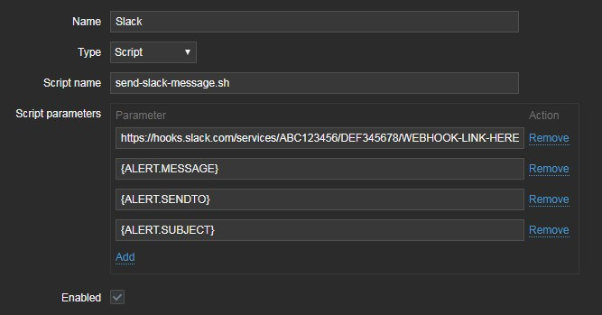
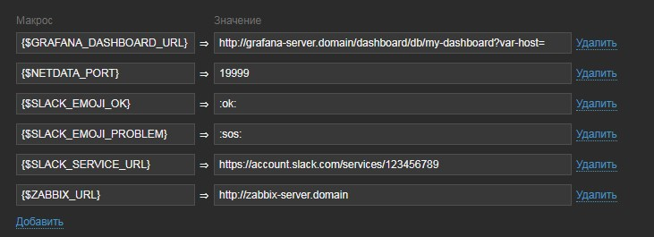
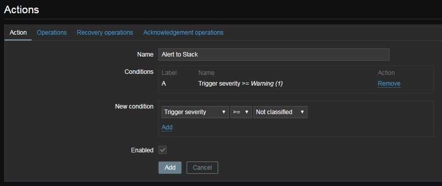
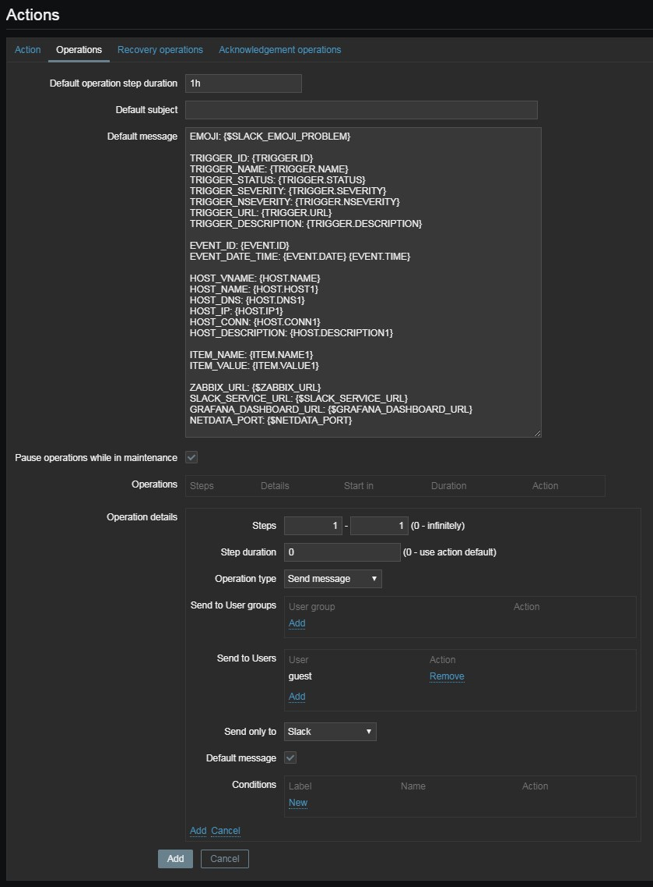
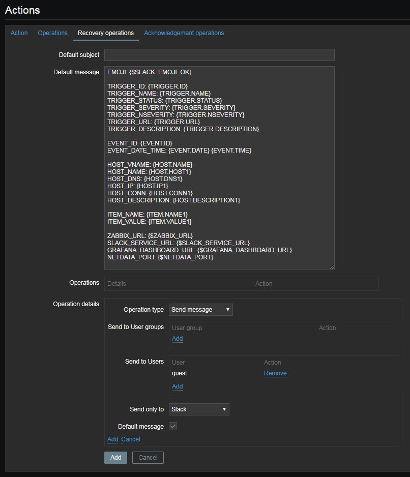

# &nbsp;Zabbix alert script for Slack

Send Zabbix alerts through [Incoming Webhook](https://api.slack.com/incoming-webhooks) to Slack, formatted with [message attachments](https://api.slack.com/docs/message-attachments).

## Installation & Configure
1. Create [Slack Incoming Webhook](https://my.slack.com/services/new/incoming-webhook/) (you can create target channel through this step) and copy Webhook URL.

2. Find you Zabbix alert scripts directory (default is `/usr/lib/zabbix/alertscripts`):
   ```
   # grep '^AlertScriptsPath' /etc/zabbix/zabbix_server.conf
   AlertScriptsPath=/usr/lib/zabbix/alertscripts
   ```

3. Download Slack alert script:
   ``` 
   # cd /usr/lib/zabbix/alertscripts
   # wget https://raw.githubusercontent.com/nikolaev-rd/Zabbix-AlertScripts/Slack/send-slack-message.sh
   ```

4. Set execution permissions for script:
   ```
   # chmod +x send-slack-message.sh
   ```

5. Add new Mediatype in Zabbix Web UI (Administration → Media types → Create media type):
   * **Name:** Slack
   * **Type**: Script
   * **Script name**: `send-slack-message.sh`
   * **Script parameters**:  
     #1. `https://hooks.slack.com/services/ABC123456/DEF345678/WEBHOOK-LINK-HERE` _(you webhook URL from step #1)_  
     #2. `{ALERT.MESSAGE}`  
     #3. `{ALERT.SENDTO}`  
     #4. `{ALERT.SUBJECT}`  
   * **Enabled**: ☑
   
   <details><summary>Show example screenshot</summary>
      
   </details>

6. Assign new media type to user (Users → select user → Media → Add):
   * **Type**: Slack
   * **Send to**: `@slack-username` _or_ `#channel_name`
   * **Enabled**: ☑

7. It's more usefull (but not requred) to add a [user macros](https://www.zabbix.com/documentation/4.0/manual/config/macros/usermacros) for some fields:
   * `{$SLACK_EMOJI_OK}` : `:sos:` or maybe `:greencheckmark:`  
     Emoji for OK message (displayed in title with trigger name).  
     _Note:_ you can add custom emoji and use it here.  
     
   * `{$SLACK_EMOJI_PROBLEM}` : `:ok:` or maybe `:greencheckmark:`  
     Emoji for PROBLEM message (displayed in title with trigger name).  
     _Note:_ you can add custom emoji and use it here. Leave this field empty if you don't want to add emoji to you messages.  
     
   * `{$ZABBIX_URL}` : something like `http://zabbix-server.domain/zabbix`
     Zabbix Server Web UI link without leading slash.  
     _Note:_ Text "Zabbix Server" will be displayed in footer **without link** in case this variable is empty.  
   
   * `{$SLACK_SERVICE_URL}` : something like `https://your-account.slack.com/services/123456789012`  
     This is link to you Slack service (copy from address bar while creating Incoming webhook), **NOT** webhook URL! It can be helpfull to find and edit this service in future.  
     _Note:_ Text "Slack incoming webhook" will be displayed in footer **without link** in case this variable is empty.  
   
   * `{$NETDATA_PORT}`: [default Netdata port](https://docs.netdata.cloud/web/server/#binding-netdata-to-multiple-ports) is `19999`.  
     If you have [Netadata](https://github.com/netdata/netdata) installed on your monitored hosts, you can specify Netdata port - link to Netdata dashboard will be displayed in footer. [Netdata logo](https://raw.githubusercontent.com/netdata/netdata/master/web/gui/images/favicon-16x16.png) also will be displayed in footer.  
   _Note:_ Leave this field empty if you don't want to add link to Netadata dashboard in footer.  
   
   * `{$GRAFANA_DASHBOARD_URL}`: something like `http://grafana-server:3000/dashboard/db/my-dashboard?var-host=`
     Grafana dashboard URL prepared for hostname selecting - need for link in footer. Host name (visible name or hostname) will be added to the end of this URL. [Grafana logo](https://raw.githubusercontent.com/nikolaev-rd/Zabbix-AlertScripts/master/_img/Grafana_logo_circle__32x32.png) also will be displayed in footer.  
     _Note:_ Leave this field empty if you don't want to add link to Grafana dashboard in footer.  
   
   <details><summary>Show example screenshot</summary>
      
   </details>

8. Create new action for Slack notifications (Configuration → Actions → Create action) or add Slack media type to existing one:
   * **Action**:  
     - **Name**: Alert to Slack
     - **Conditions**: customize to get only events about you want to alert
     - **Enabled**: ☑
     
     <details><summary>Show example screenshot</summary>
        
     </details>
     
   * **Operations**:
     - **Operation type**: Send message
     - **Send to User groups** or **Send to Users**: choose contacts from step #6
     - **Send only to**: Slack
     - **Subject**: empty _or_ Username (from field) - will override prefered Username in Slack Incoming Webhook settings
     - **(Default) Message**:
       ```
       EMOJI: {$SLACK_EMOJI_PROBLEM}
       
       TRIGGER_ID: {TRIGGER.ID}
       TRIGGER_NAME: {TRIGGER.NAME}
       TRIGGER_STATUS: {TRIGGER.STATUS}
       TRIGGER_SEVERITY: {TRIGGER.SEVERITY}
       TRIGGER_NSEVERITY: {TRIGGER.NSEVERITY}
       TRIGGER_URL: {TRIGGER.URL}
       TRIGGER_DESCRIPTION: {TRIGGER.DESCRIPTION}
       
       EVENT_ID: {EVENT.ID}
       EVENT_DATE_TIME: {EVENT.DATE} {EVENT.TIME}
       
       HOST_VNAME: {HOST.NAME}
       HOST_NAME: {HOST.HOST1}
       HOST_DNS: {HOST.DNS1}
       HOST_IP: {HOST.IP1}
       HOST_CONN: {HOST.CONN1}
       HOST_DESCRIPTION: {HOST.DESCRIPTION1}
       
       ITEM_NAME: {ITEM.NAME1}
       ITEM_VALUE: {ITEM.VALUE1}
       
       ZABBIX_URL: {$ZABBIX_URL}
       SLACK_SERVICE_URL: {$SLACK_SERVICE_URL}
       GRAFANA_DASHBOARD_URL: {$GRAFANA_DASHBOARD_URL}
       NETDATA_PORT: {$NETDATA_PORT}
       ```
     
     <details><summary>Show example screenshot</summary>
        
     </details>
     
   * **Recovery operations**:
     - **Operation type**: Send message
     - **Send to User groups** or **Send to Users**: choose contacts from step #6
     - **Send only to**: Slack
     - **Subject**: empty _or_ Username (from field) - will override prefered Username in Slack Incoming Webhook settings
     - **(Default) Message**:
       ```
       EMOJI: {$SLACK_EMOJI_OK}
       
       TRIGGER_ID: {TRIGGER.ID}
       TRIGGER_NAME: {TRIGGER.NAME}
       TRIGGER_STATUS: {TRIGGER.STATUS}
       TRIGGER_SEVERITY: {TRIGGER.SEVERITY}
       TRIGGER_NSEVERITY: {TRIGGER.NSEVERITY}
       TRIGGER_URL: {TRIGGER.URL}
       TRIGGER_DESCRIPTION: {TRIGGER.DESCRIPTION}
       
       EVENT_ID: {EVENT.ID}
       EVENT_DATE_TIME: {EVENT.DATE} {EVENT.TIME}
       
       HOST_VNAME: {HOST.NAME}
       HOST_NAME: {HOST.HOST1}
       HOST_DNS: {HOST.DNS1}
       HOST_IP: {HOST.IP1}
       HOST_CONN: {HOST.CONN1}
       HOST_DESCRIPTION: {HOST.DESCRIPTION1}
       
       ITEM_NAME: {ITEM.NAME1}
       ITEM_VALUE: {ITEM.VALUE1}
       
       ZABBIX_URL: {$ZABBIX_URL}
       SLACK_SERVICE_URL: {$SLACK_SERVICE_URL}
       GRAFANA_DASHBOARD_URL: {$GRAFANA_DASHBOARD_URL}
       NETDATA_PORT: {$NETDATA_PORT}
       ```
     
     <details><summary>Show example screenshot</summary>
        
     </details>

## TODO
- [ ] Add example Slack messages screenshots
- [ ] Instructions how to test/verify integration
